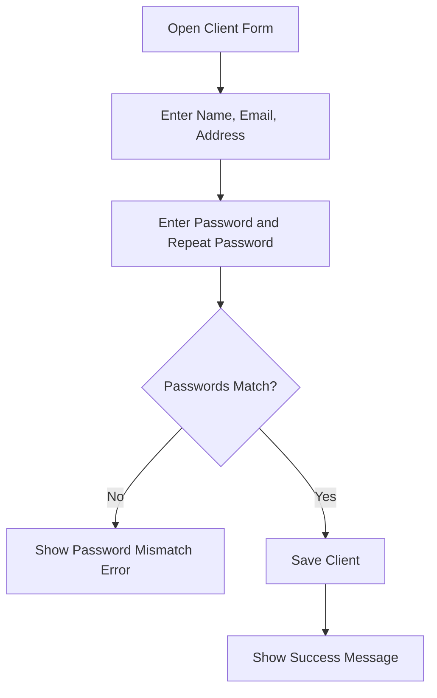
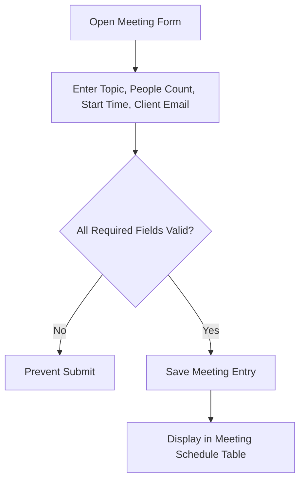

# Phase-End Project Writeup

## Name
Manoj

## Project
Client Management Application for handling client registration and meeting schedules for parallel project execution.

## Sprint Planning
- **Method:** Agile Scrum
- **Sprint Length:** 2 weeks
- **Sprint Goal:** Deliver a working client management UI with client and meeting workflows, plus project artifacts.
- **Epics:**
  1. Client Management
  2. Client Meetings
- **User Stories:**
  - Register client
  - View client records
  - Schedule client meetings
  - View meeting schedule
- **Definition of Done:**
  - Angular app runs successfully
  - Core forms validated
  - MySQL schema available
  - BDD scenarios documented
  - Code synced in GitHub repository

## Flow Diagrams
### Client Registration Flow

### Meeting Scheduling Flow

## Technologies Used
- Agile and Scrum for planning
- Jira (or equivalent tracking board) for epics, user stories, and sprint tracking
- HTML5 and CSS3 for page structure and styling
- JavaScript/TypeScript via Angular framework
- Angular CLI for project scaffolding and build/test lifecycle
- MySQL for relational database schema design
- Git and GitHub for source code management and collaboration
